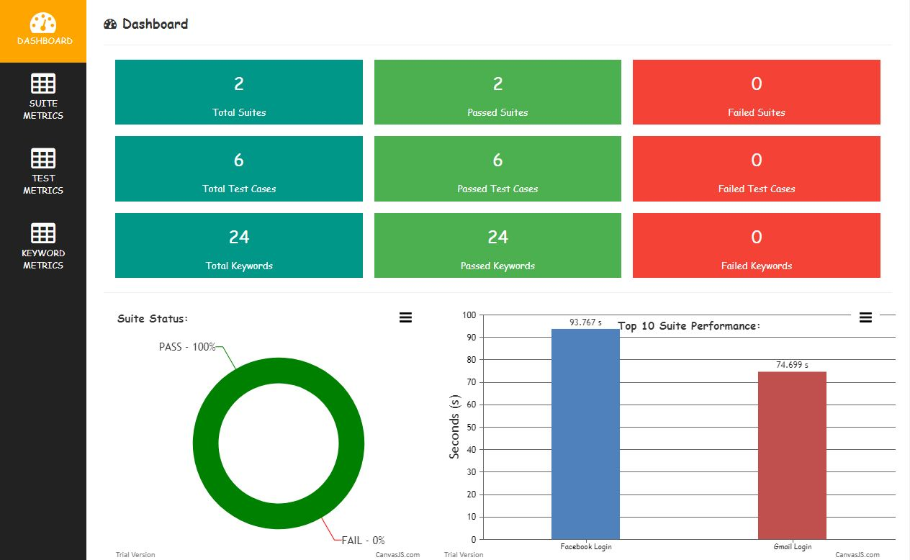
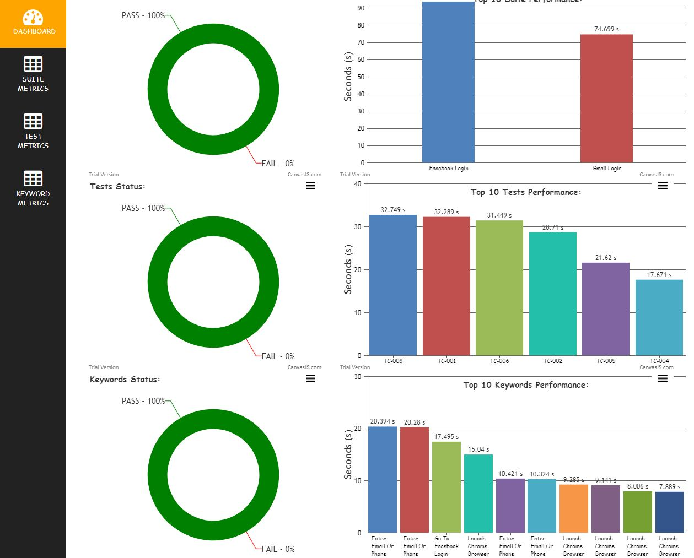
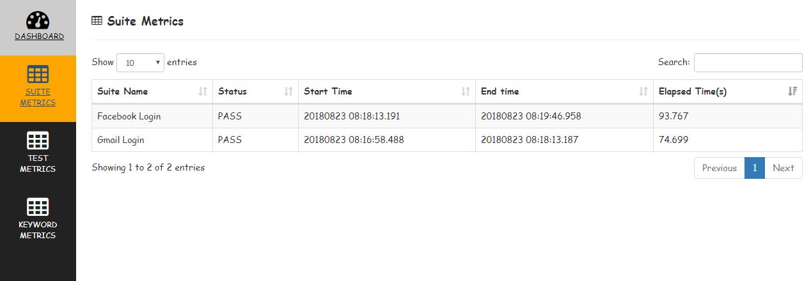
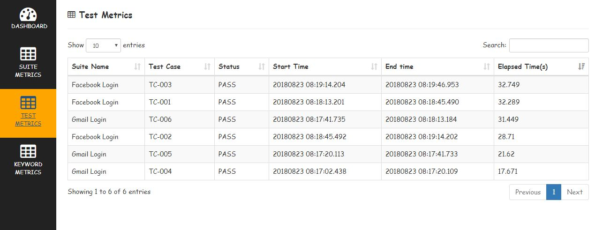
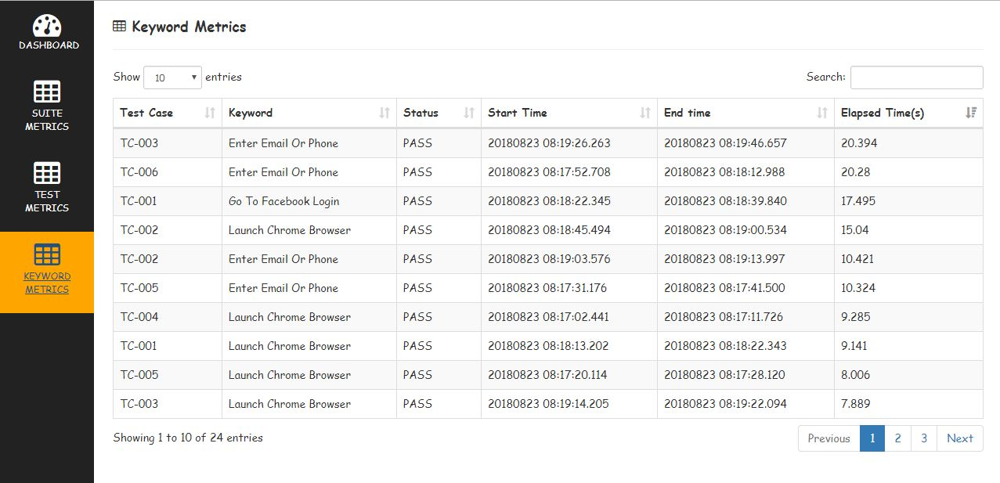

# Robot Framework Metrics Report

Creates HTML metrics report based on robotframework output.xml

---

*How it Works:*

1. Read output.xml file using robotframework API (robot.result.model)
2. Get Test Case Name , Keyword Name, Status, Start Time, End Time and Elapsed time values using api
3. Convert data to html report using Beautifulsoup

---

*How to use in project:*

1. Clone project or download here [link](https://github.com/adiralashiva8/robotframework-metrics/archive/master.zip)
    ```
    git clone https://github.com/adiralashiva8/robotframework-metrics.git
    ```
2. Copy __rf_metrics_report_creator.py__ and __rf_metrics_executer.sh__ files to project (where output.xml file is available)
3. Install beautifulsoup: (to create html report - one time activity)
    ```
    pip install beautifulsoup4
    ```
4. Execute __rf_metrics_executer.sh__ file
5. __Robotframework Metrics Report__ will be launched in new chrome tab

    > Assumption __Python__ already installed in machine

---

 *Sample Report:*

 __DASHBOARD__





__SUITE METRICS__

 
 
__TEST METRICS__

 
 
__KEYWORD METRICS__

 

---

*How to Ignore Library Keywords in Metrics Report*
 - In __rf_metrics_report_creator.py__ file add specific library keywords to tuple __ignore_library__ to ignore in report
 - In Metric report, keywords with type value 'for' and 'foritem' are ignored
 - Following library keywords are ignored in Metrics Report
    ```
    ignore_library = [
     'BuiltIn',
     'SeleniumLibrary',
     'String',
     'Collections',
     'DateTime',
    ] 
    ```

---

*Credits:*

1. Robotframework
2. W3Schools
3. Stackoverflow
4. CanvasJs
5. DataTable
6. BeautifulSoup
7. Jquery | JavaScript
8. Bootstrap

---

> You are watching first HTML 'Metrics Report' in Robot framework.

---
