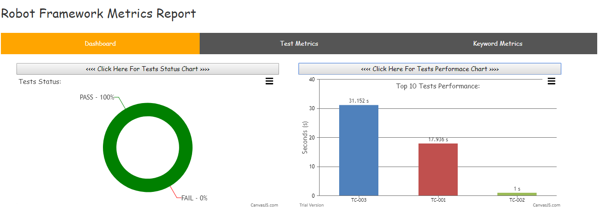
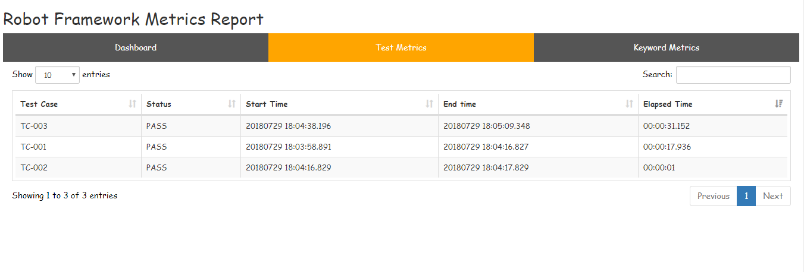
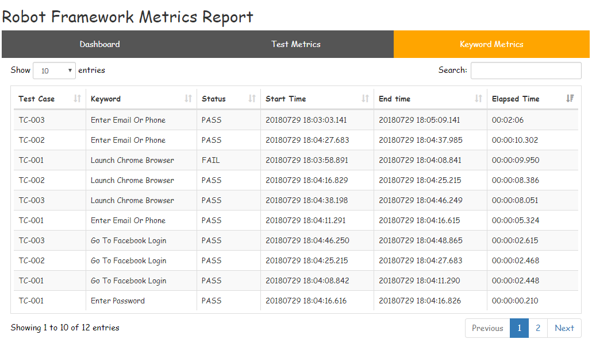

# Robot Framework Metrics Report

Aim of this project is to create HTML report based on robot framework output.xml (To analyze TESTS, KEYWORDS in entire suite | test execution)

---

*How it Works:*

1. Read output.xml file (which will be created after script execution)
2. Get Test Case Name (test tag) , Keyword Name (kw tag) , Start Time, End Time (status tag) values from output.xml file
3. Convert data to html report using Beautifulsoap (Tabular format with sorting | pagination | search entire table | sort in search result)

---

*How to use in project:*

1. Checkout the project
2. Copy __rf_metrics_report_creator.py__ and __rf_metrics_executer.sh__ files to project (where output.xml file is available)
3. Install beautifulsoap: __pip install beautifulsoup4__  (to create html report)
4. Install lxml: __pip install lxml__ (to read data from xml file)
5. Execute __rf_metrics_executer.sh__ file
6. "RF_Metrics_Report" will be opened in new chrome tab

---

 Sample Report:(Tabular format with sorting | pagination | search entire table | sort in search result )
 
 Dashboard: (Consist of Keywords, Tests status charts)
 

 Test Metrics:  (Test Metrics - Sort by Elapsed time descending order)
 

 Keyword Metrics: (Keywords Metrics - Sort by Elapsed time descending order)
 

---

*How to Ignore Library Keywords in Performance Metrics Report*
 - In __rf_metrics_report_creator.py__ file add specific library keywords to tuple __ignore_library__
 - In Performance Metric report, keywords with type value 'for' and 'foritem' are ignored
 - Following library keywords are ignored in Performance Metrics Report
    ```
    ignore_library = [
     'BuiltIn',
     'SeleniumLibrary',
     'String',
     'Collections',
     'DateTime',
    ] 
    ```
---

 **TODO:**
- [ ] Show loading indicator while report is loading
- [X] Show charts on page load
- [ ] Improve performance while converting .xml to .html using Thread | Multiprocess
- [ ] Read output.xml irrespective folder location

---

Intention of project is to help the guys who are monitoring there TESTS | KEYWORDS performance

 - Checkout the project.
 - Try within your project.
 - Suggest your feedback | queries
 - Let us improve this report together

 > You are watching first 'Performance Metrics HTML Report' in Robot framework :)
 
---