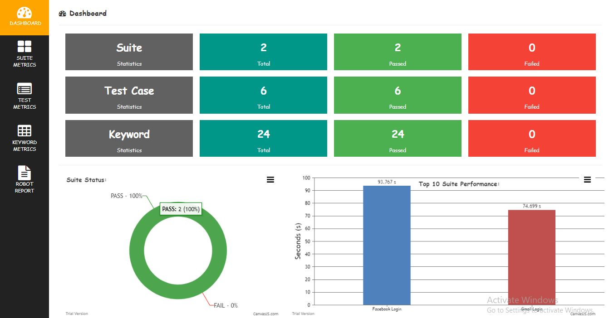
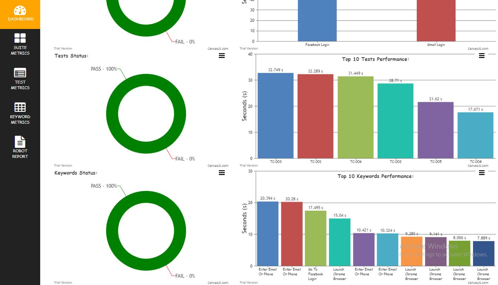
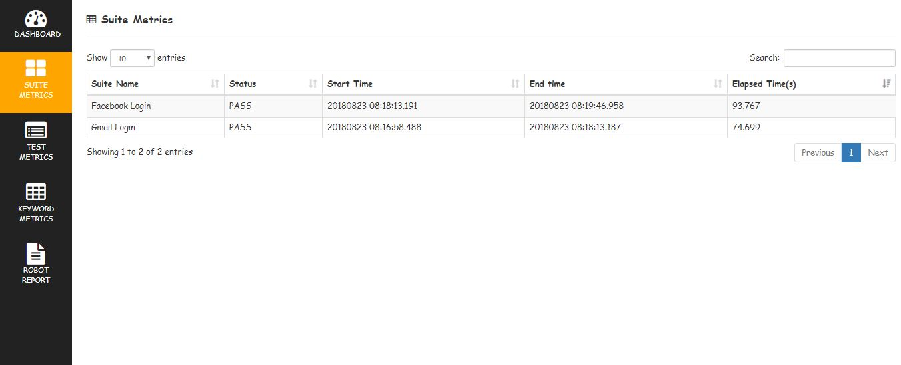
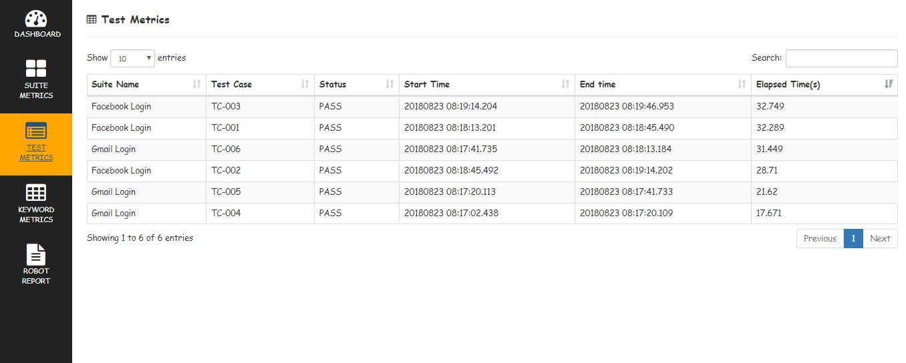
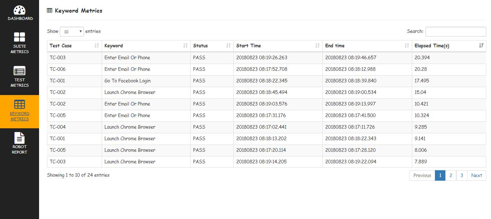
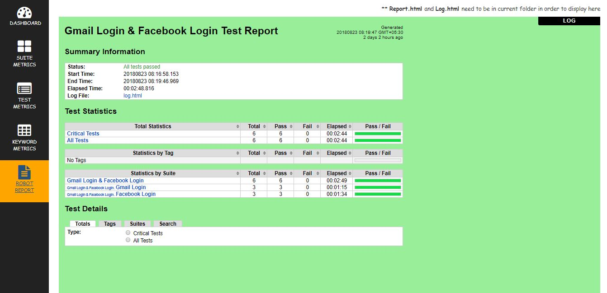
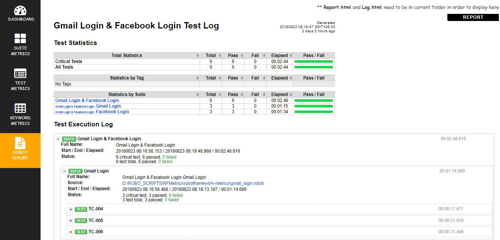

# Robot Framework Metrics Report

Creates HTML metrics report based on robotframework output.xml

---

*How it Works:*

1. Read output.xml file using robotframework API (robot.result.model)
2. Get Test Case Name , Keyword Name, Status, Start Time, End Time and Elapsed time values using api
3. Convert data to html report using Beautifulsoup

---

*How to use in project:*

1. Clone project or download here [link](https://github.com/adiralashiva8/robotframework-metrics/archive/master.zip)
    ```
    git clone https://github.com/adiralashiva8/robotframework-metrics.git
    ```
2. Copy __rf_metrics_report_creator.py__ and __rf_metrics_executer.sh__ files to project (where output.xml file is available.)
    > Note: __output.xml__ having timestamp is auto recognized by Metrics Report but output.xml, report.html and log.html need to be within folder.
3. Install beautifulsoup: (to create html report - one time activity)
    ```
    pip install beautifulsoup4
    ```
4. Execute __rf_metrics_executer.sh__ file
5. __Robotframework Metrics Report__ will be launched in new chrome tab

    > Assumption __Python__ already installed in machine

    If you were using latest python. Please upgrade robotframework to generate report
        
    > Update Robot Framework
    ``` pip install --pre --upgrade robotframework ```
---

 *Sample Report:*

 __DASHBOARD__





__SUITE METRICS__

 
 
__TEST METRICS__

 
 
__KEYWORD METRICS__

 

__RF REPORT__

 

 

---

*How to Ignore Library Keywords in Metrics Report*
 - In __rf_metrics_report_creator.py__ file add specific library keywords to tuple __ignore_library__ to ignore in report
 - In Metric report, keywords with type value 'for' and 'foritem' are ignored
 - Following library keywords are ignored in Metrics Report
    ```
    ignore_library = [
     'BuiltIn',
     'SeleniumLibrary',
     'String',
     'Collections',
     'DateTime',
    ] 
    ```

---

*Frequently Asked Queries*
 - I dont have chrome browser will Metrics Report works
    > Yes, Generate report by executing ```   python rf_metrics_report_creator.py ``` command and open __rf_metrics_result.html__ in your favorite browser
 - Can I change font style of report
    > Yes, By changing __font-family:__ value in __rf_metrics_report_creator.py__ file

---

*Credits:*

1. Robotframework [link](http://robotframework.org)
2. W3Schools [link](http://www.w3schools.com)
3. Stackoverflow [link](http://stackoverflow.com)
4. CanvasJs [link](https://canvasjs.com)
5. DataTable [link](https://datatables.net)
6. BeautifulSoup [link](http://beautiful-soup-4.readthedocs.io)
7. Jquery | JavaScript [link](https://www.jqueryscript.net)
8. Bootstrap [link](https://getbootstrap.com/)
9. Icons8 [link](https://icons8.com/)
10. FontAwesome [link](https://fontawesome.com)

---

> You are watching first HTML 'Metrics Report' in Robot framework.

---
